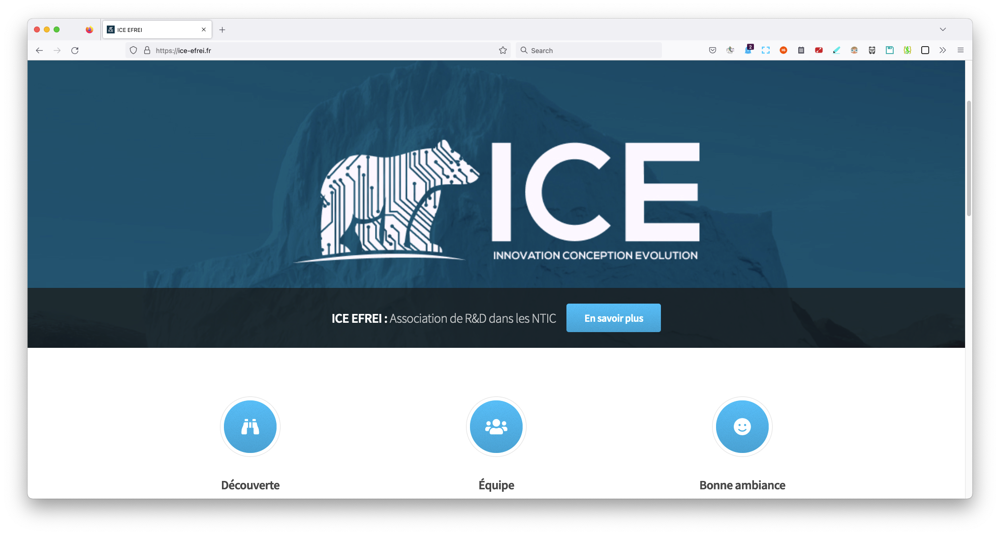

# ICE EFREI : site vitrine basique

Ceci est le dépôt Github du site vitrine de ICE EFREI, Association de R&D dans les NTIC. Il a été créé de base
pour supporter les liens de redirection personnalisés, e.g. [ice-efrei.fr/instagram](https://ice-efrei.fr/instagram).



## Configuration
Les éléments de la page d'accueil sont définis dans `/data/homepage.yml`. Les éléments statics (images, fichiers, etc.)
dans `/static/`.

## Ajouter un post
Hugo est un framework Golang qui permet de générer des pages HTLM à partir de fichiers markdown simple. Ainsi, pour 
créer un nouveau post il vous suffit de rajouter un fichier dans `/content/post/`, nommez le `<nom du projet>.md`. 

Il doit contenir l'entête suivant pour être répertorié. Notez que l'image doit être stockée dans `/static/images/`. 
Pour des questions de cohérences avec les autres projets, je vous invite à, via figma, appliquer le _blend mode_ 
"soft-light" sur l'image sur figma avec un fond uni de couleur bleu ICE - #143649. TODO: faire un tuto
```markdown
---
title: <nom du projet>
image: images/<nom de l'image>
date: "2021-10-04T00:00:00"
tags:
  - exemple
  - de
  - tags possibles
---
```

La suite du fichier sera le contenu du post, comme vous pouvez le voir sur les précedents posts, vous pouvez utiliser
la [mise en forme markdown](https://fr.wikipedia.org/wiki/Markdown). Notez que ce qui est écrit avant la ligne
`<!-- more -->` sera visible en tant que description sur la page d'accueil et la page listant tous les postes.

## Ajouter une redirection
Rajoutez un fichier `<redirection name>.md` dans `/content`, il doit ensuite avoir la forme suivante si vous ne savez pas
quoi faire :
```markdown
---
title: "<redirection name>"
description: "<redirection name> link"
menu: redirect
weight: 60
image: images/banner.jpg
image_alt: "banner"
tags: []
---
<script>
    window.location.href = "<redirection link>";
</script>
```

## Crédits
Zhou-efr - président 2021-2022 😎.  
Fait avec [hugo](https://gohugo.io/), thème [arcana](https://github.com/half-duplex/hugo-arcana) par 
[HTML5 UP](https://html5up.net).